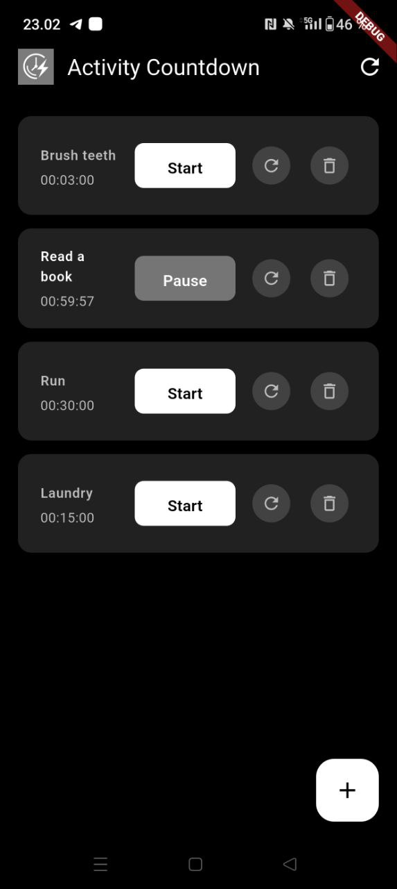
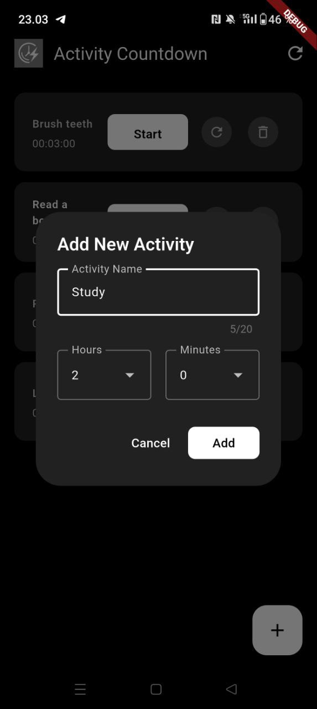
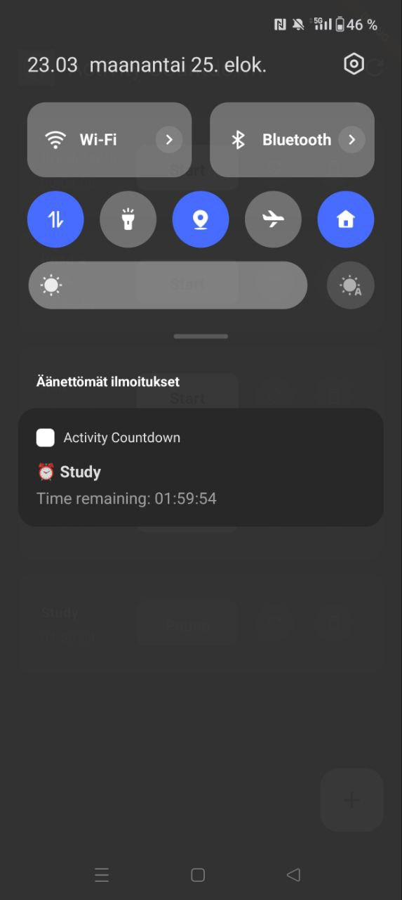
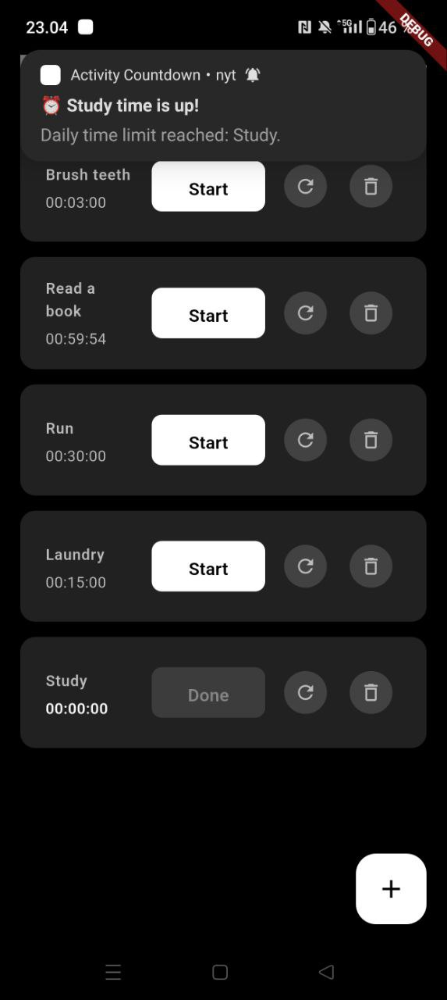

# Activity Countdown

A minimal mobile app made with Dart + Flutter for tracking daily activity time limits with persistent notifications and dark UI.

## Screenshots

    

## Features

- **Daily time tracking**: Set custom time limits for activities (hours and minutes)
- **Persistent notifications**: See remaining time in notification panel even when using other apps
- **Smart timer management**: Start, pause, resume, and reset individual timers
- **Daily reset**: Timers automatically reset each day for consistent daily limits
- **Dark thheme**: Modern, eye-friendly dark interface
- **State persistence**: App remembers your activities and timer states
- **Real-time updates**: Countdown updates every second with live notifications
- **Responsive design**: Optimized for mobile with intuitive touch controls

## Getting Started

### Prerequisites

- Flutter SDK (3.0.0 or higher)
- Android Studio / VS Code
- Android device or emulator (API level 26+)

### Installation

1. **Clone the repository**
   ```bash
   git clone https://github.com/yourusername/activity-countdown.git
   cd activity-countdown
   ```

2. **Install dependencies**
   ```bash
   flutter pub get
   ```

3. **Run the app**
   ```bash
   flutter run
   ```

## How to Use

### Adding Activities
1. Tap the **+** button to add a new activity
2. Enter an activity name (max 20 characters)
3. Set your daily time limit in hours and minutes
4. Tap **Add** to create the activity

### Managing Timers
- **Start**: Begin counting down from your daily limit
- **Pause**: Temporarily stop the timer (notification disappears)
- **Resume**: Continue from where you left off (notification reappears)
- **Reset**: Reset timer to daily limit
- **Delete**: Remove activity completely

### Notifications
- **Persistent**: Shows remaining time in notification panel
- **Real-time**: Updates every second
- **Smart**: Automatically manages notification states
- **Background**: Continues working when app is minimized

## Technical Details

### Built With
- **Flutter**: Cross-platform mobile development framework
- **Dart**: Programming language
- **SharedPreferences**: Local data persistence
- **Flutter Local Notifications**: Persistent timer notifications

### Architecture
- **Stateful Widgets**: Efficient state management
- **Timer Management**: Real-time countdown updates
- **Data Persistence**: Local storage with automatic saving
- **Lifecycle Management**: Proper app state handling

### Key Components
- `HomeScreen`: Main app interface with activity list
- `ActivityCard`: Individual activity display and controls
- `AddActivityDialog`: New activity creation form
- `Activity`: Data model for activities and timer state

## Project Structure

```
activity-countdown/
├── lib/
│   └── main.dart          # Main application code
├── android/                # Android-specific configuration
├── assets/
│   └── logo.png           # App logo
├── pubspec.yaml           # Dependencies and configuration
└── README.md              # This file
```

## Configuration

### App Icon
The app uses a custom logo. To update:
1. Replace `logo.png` in the project root
2. Run `flutter pub run flutter_launcher_icons:main`
3. Rebuild the app

## License

This project is licensed under the MIT License. [LICENSE](LICENSE) file for details.
